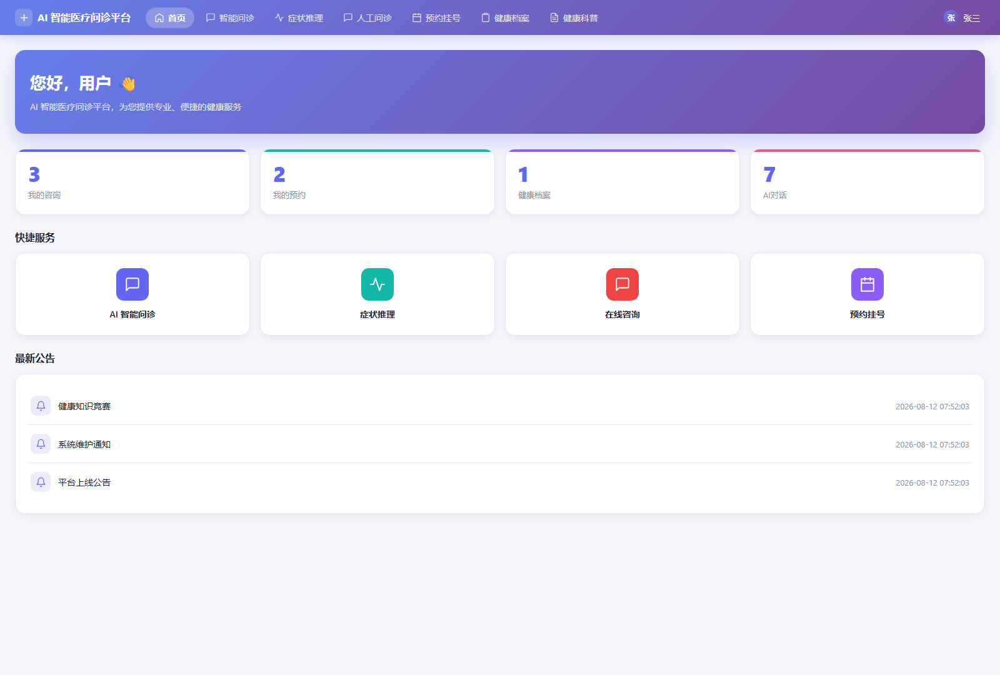
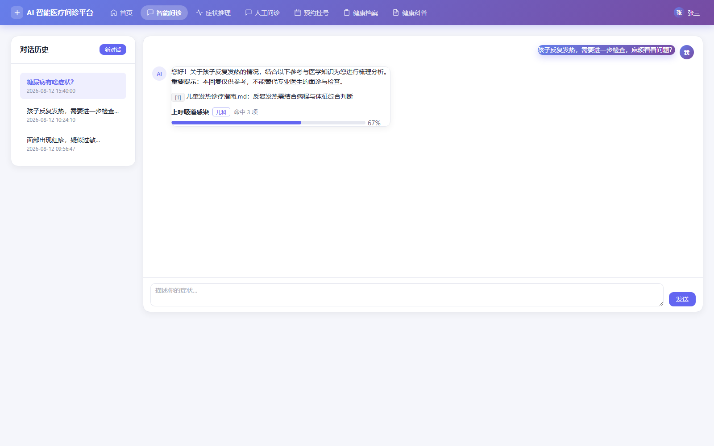
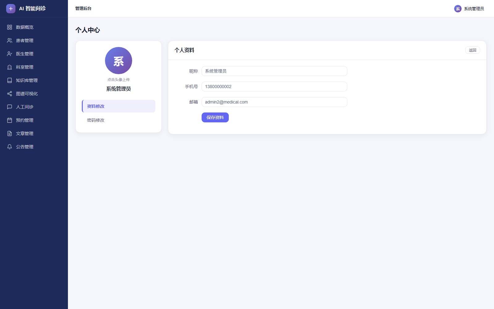
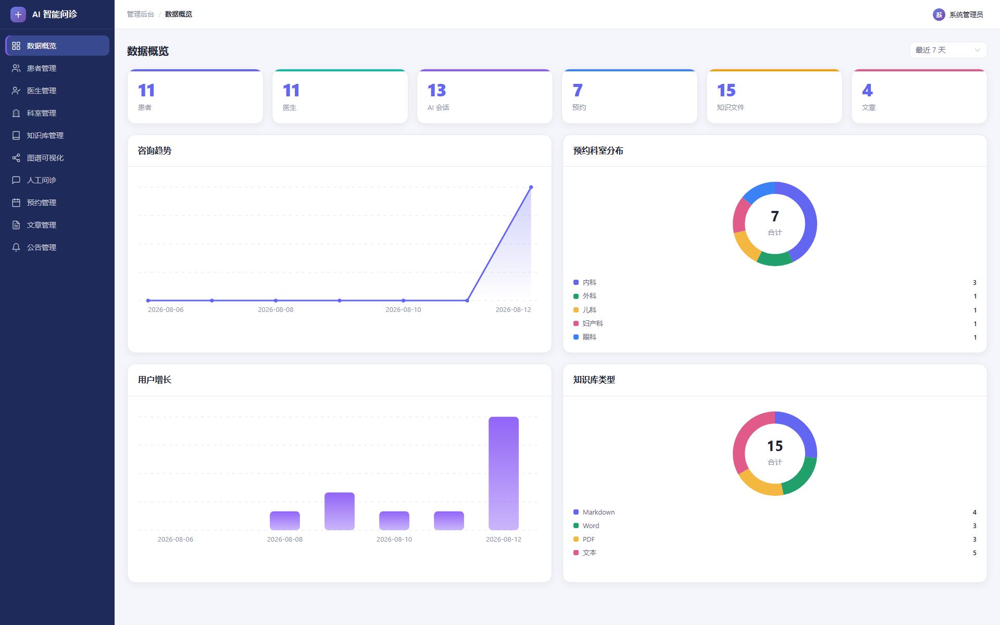
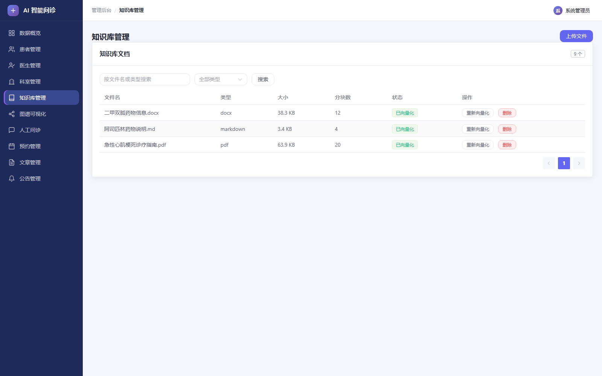
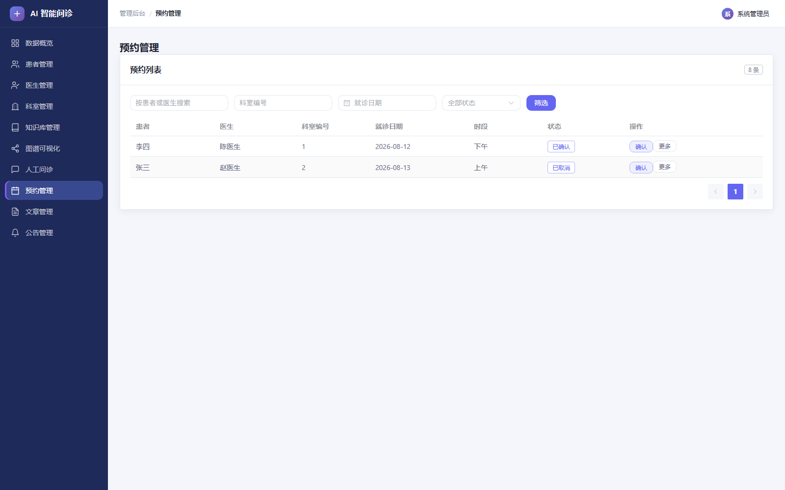
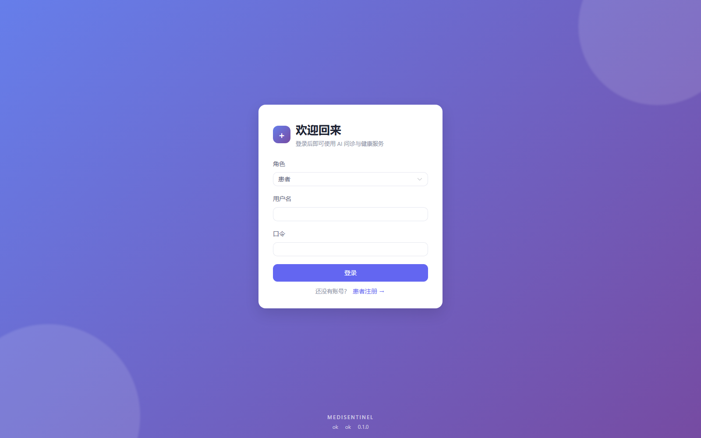

# MediSentinel · AI 智能医疗问诊平台

> 一个把 AI 问诊链路**拆成五个可独立测试的 Skill** 的重构项目：安全门、症状归一化、向量检索、图谱推理、编排。后端全异步（FastAPI + SQLAlchemy 2.0 + Neo4j + Chroma），前端 Vue 3 三端（患者门户 / 医生工作台 / 管理后台）共用一套设计令牌。

这里的重点不是「接一个大模型」，而是**确定性优先**的工程取舍：安全判断、症状归一化、图谱推理全部由确定性规则完成，大模型只负责最后的自然语言组织；每一次调用都留痕，可在不触达外部依赖的前提下回放整次问诊。

## 核心特性

- 🛡️ **安全先行** —— 红旗症状在**调用大模型之前**确定性拦截，命中即全链路短路（归一化 / 检索 / 图谱 / 生成都不执行），并经 trace 审计。
- 🧩 **五 Skill 编排** —— 每个 Skill 有独立契约（输入输出 Schema / 触发条件 / 边界情况 / 测试用例），可脱离关系库、图库单独实例化测试。
- 🔎 **双支路 RAG** —— 向量检索与图谱推理**并行且互不筛选**；任一支路不可用即降级（`degraded`），问答继续而不是整体失败。
- 🧾 **可回放 trace** —— 每次 Skill 与大模型调用都留下结构化 span，足以在不访问外部依赖的前提下重放一次问诊并比对结果。
- 🎨 **三端一致 UI** —— 患者 / 医生 / 管理端共用设计令牌（紫色渐变主色、深色侧边栏、卡片化内容区），Element Plus 按需引入。

## 界面预览

**患者端**：首页概览 · AI 问诊 · 个人中心

<p align="center">
  
  
  
</p>

**管理端**：数据概览 · 知识库管理 · 预约管理

<p align="center">
  
  
  
</p>

**公开页**：登录（注册同款布局，登录时可选患者 / 医生 / 管理员）

<p align="center">
  
</p>

> **当前状态：功能已完整落地。** TICKET-001…026 已实现五个 Skill 的编排链路、三角色认证与全部业务域（AI 问诊、知识库、图谱、预约与健康档案、人工问诊、文章公告、统计、可观测性与回归基线），并提供一份演示数据 `server/seeds/demo_v1.sql`。下文「架构」描述的是 `SPEC.md` 规定的目标形态，实现与其一致。

## 文档

| 文档 | 内容 |
|---|---|
| [`SPEC.md`](./SPEC.md) | 目标架构规格：问题、目标、约束、seam、接口契约、验收标准、范围外事项。 |
| [`docs/agents/`](./docs/agents/) | 本仓库的工程技能配置：issue tracker、triage 标签、领域文档约定。 |

> 功能层「现状行为」规格（`FUNCTIONAL_SPEC.md`）不随本仓库发布；对外行为以 `SPEC.md` 第 5 章的接口契约与 `contracts/` 为准。

## 架构

Monorepo，前后端分离，无共享代码、无统一构建：

```
.
├── server/          后端：异步 FastAPI + 五 Skill 编排
└── client/          前端：Vue 3 单页应用
```

### AI 链路的五个 Skill

一次问诊的推理被拆成五个边界清晰、契约明确、可独立测试的 Skill（详见 `SPEC.md` 第 4 章）：

| 顺序 | Skill | 类别 | 调用大模型 |
|---|---|---|---|
| 1 | `safety-gate` 安全约束 | Process Rules Skill | 否 |
| 2 | `symptom-normalization` 症状归一化 | 确定性能力 Skill | 否 |
| 3a | `vector-retrieval` 向量检索 | 确定性能力 Skill | 否 |
| 3b | `graph-inference` 图谱推理 | 确定性能力 Skill | 否 |
| 4 | `orchestration` 编排 | 编排 Skill | **是（唯一）** |

单次问诊流程：

```
用户输入
   │
   ▼
[编排 Skill] 生成 trace_id
   │
   ├─▶ ① 安全约束 Skill ── intercept ──▶ 直接返回安全提示（不调用大模型）
   │                     └─ allow ─┐
   ├─▶ ② 症状归一化 Skill            │
   ├─▶ ③ 并行双支路                  │
   │      ├── 向量检索 Skill ──▶ 知识片段 + 引用
   │      └── 图谱推理 Skill ──▶ 候选疾病（coverage 排序）
   ├─▶ ④ 上下文组装（确定性）
   └─▶ ⑤ 大模型流式生成 ──▶ SSE 事件流
                │
                ▼
        trace 落库，可回放
```

要点：安全门在**大模型调用之前**执行且命中即全链路短路；归一化只使用**一份**症状词表；检索与图谱**并行且互不筛选**；每次 Skill 调用与大模型调用都留下可回放的结构化 trace。

### 技术栈

| 层 | 技术 |
|---|---|
| 后端 | Python / FastAPI（全异步路由）/ SQLAlchemy 2.0 `AsyncSession` / httpx 异步调用兼容 OpenAI 的 LLM 与嵌入服务 |
| 数据 | MySQL（14 个实体）/ Neo4j 异步驱动（医学知识图谱）/ Chroma 本地持久化（向量索引） |
| AI | 兼容 OpenAI 接口的大模型与嵌入服务 |
| 前端 | Vue 3 + Vite + Vue Router + Pinia + Element Plus（按需引入），仅通过 RESTful API（含 SSE）通信；图表为自绘内联 SVG，无第三方图表依赖 |

**配置**：连接串、口令与密钥一律经环境变量注入，由 `server/.env` 提供——`core.config.Settings` 读取，样例见 `server/.env.example`。`DATABASE_URL` 必填；缺失时后端启动即报错，不再退回源码里的默认值（TICKET-027）。

## 启动方式

后端提供全部业务端点，前端按角色提供各自的视图。

### 前置依赖

- Python 3.11+
- Node.js 18+
- MySQL（`utf8mb4`）与 Neo4j —— 只有跑真实业务时才需要；不启动也能起服务与跑测试
- 大模型/嵌入服务的 API Key

### 后端

```bash
cd server
python -m venv .venv
.venv\Scripts\activate          # Windows；Linux/macOS 用 source .venv/bin/activate
pip install -r requirements-dev.txt   # 含测试依赖；只运行服务可用 requirements.txt

# 配置：复制样例再填写（.env 已被 gitignore）。
# 至少填 DATABASE_URL；需要图谱/令牌/大模型时再补 NEO4J_*、JWT_SECRET_KEY、OPENAI_*。
copy .env.example .env          # Linux/macOS 用 cp .env.example .env

alembic upgrade head            # 建表：应用 Schema 迁移，可重复执行
uvicorn main:app --reload --port 8000
```

接口文档：`http://127.0.0.1:8000/docs`

MySQL 未启动时健康端点不会崩，而是把 `database` 报成 `unavailable`。

### 前端

```bash
cd client
npm install
npm run dev                     # http://localhost:5173
```

开发期由 Vite 代理把 `/api` 与静态资源前缀转发到 `http://127.0.0.1:8000`。

### 初始化数据

需先启动 MySQL 与 Neo4j：

```bash
alembic upgrade head              # 建表：应用 Schema 迁移（见 docs/adr/0001-*.md）

# 演示数据：科室 / 三角色账号 / 预约 / 健康档案 / 人工问诊 / 文章公告 / 会话。
# 只写关系库、不建表，固定编号 9001+ 且可重复执行；向量数据由下一行的脚本负责。
mysql --default-character-set=utf8mb4 -uroot -p medi_sentinel < seeds/demo_v1.sql

python scripts/init_graph.py      # 知识图谱灌数（幂等）
python scripts/init_knowledge.py  # 知识库种子文档灌入并向量化（幂等）
```

演示账号：`patient1` / `doctor1` / `admin1`（患者 / 医生 / 管理员），口令均为
`123456`。Windows 上 `mysql` 客户端必须带 `--default-character-set=utf8mb4`，否则
中文会按本地代码页发送并报 `Incorrect string value`。

种子文档位于 `server/docs_seed/`，由 `init_knowledge.py` 读取；该目录缺失时脚本提示并退出。
图谱查询走 Neo4j **异步驱动**（`AsyncGraphDatabase`，TICKET-013）；向量索引是本地持久化的
Chroma（`server/chroma_db`），嵌入服务经 `OPENAI_API_KEY` 调用。外部服务不可用时脚本给出
明确错误并以非零码退出，服务侧的图谱/检索支路则降级而不阻断问答。

## 测试

```bash
cd server
.venv\Scripts\python.exe -m pytest -q     # 后端

cd ../client
npm test                                  # 前端
```

后端默认连 MySQL，测试则用 SQLite，不需要启动任何外部服务。

## 契约

`contracts/` 是前后端共同的事实来源，独立于两侧实现：

- `contracts/openapi.json` —— REST 契约，由应用生成后提交
- `contracts/sse-events.json` —— SSE 帧 Schema（`POST /api/v1/chat/send`）

应用改动后重新生成 REST 契约：

```bash
cd server
.venv\Scripts\python.exe scripts\export_contract.py
```

两侧测试都对着这两份文件校验：后端断言产出满足契约，前端断言能解析契约声明的全部形状；契约与实现不一致时测试会失败。

## 回归基线

行为回归框架（TICKET-023，`SPEC.md` 3.8）由两条命令驱动；用例集与基线是版本控制
的数据（`server/regression/cases/`、`server/regression/baselines/`），随代码一同入库：

```bash
cd server
.venv\Scripts\python.exe scripts\regression.py record --case-set v1 --baseline-version v1
.venv\Scripts\python.exe scripts\regression.py replay --case-set v1 --baseline-version v1
```

`record` 用确定性端口离线录制基线（不触碰图库、向量索引、嵌入服务与大模型）；
`replay` 只读基线重建一次问诊并打印 `MetricsReport`（红旗拦截率、误拦率、诊断漂移率、
幻觉率与按 `intercepted`/`llm`/`degraded` 分组的 P95 延迟），回放期间外部调用次数为 0。
拦截率 < 100% 或误拦率 > 0% 时以非零码退出。同一版本也可经 `POST /regression/runs`
提交、`GET /regression/runs/{run_id}` 轮询。

## 工程约定

- **仓库结构**：Monorepo，`client/` 与 `server/` 两个顶层目录。
- **业务规则**：全部校验、状态语义、权限判定、级联规则都在后端；前端不得复制业务规则作为唯一依据。
- **领域文档**：`docs/adr/`（架构决策记录），人类可读索引入口是根目录 `DECISIONS.md`，见 [`docs/agents/domain.md`](./docs/agents/domain.md)。
- **Issue tracker**：本地 markdown，`.scratch/<feature-slug>/`，见 [`docs/agents/issue-tracker.md`](./docs/agents/issue-tracker.md)。
- **回归基线**：基线用例集与录制结果纳入版本控制，不忽略。

## 范围外

见 `SPEC.md` 第 7 章。凭据与传输加固、数据内容治理、容器化与 CI/CD、历史数据迁移、提示词调优、多租户与国际化等均明确不在本次范围内。
